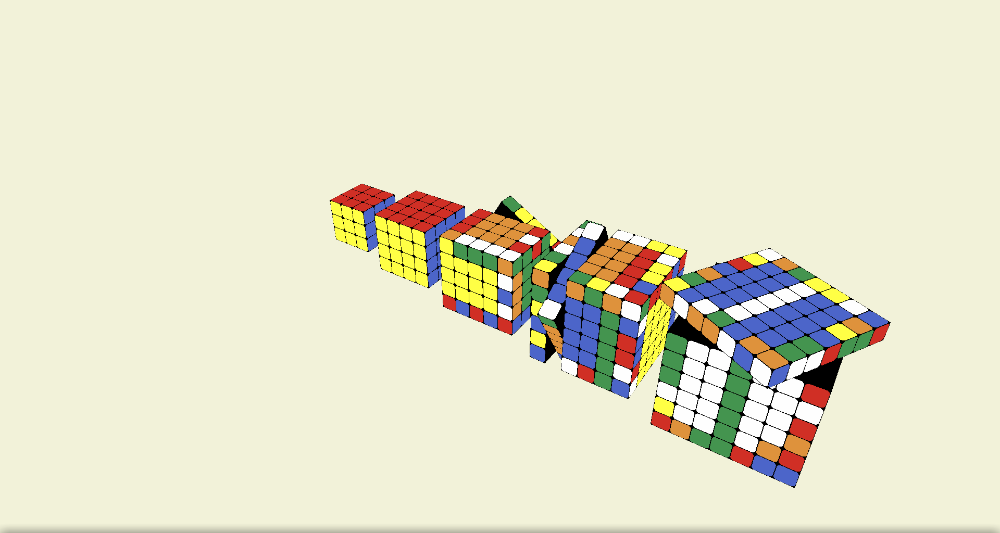
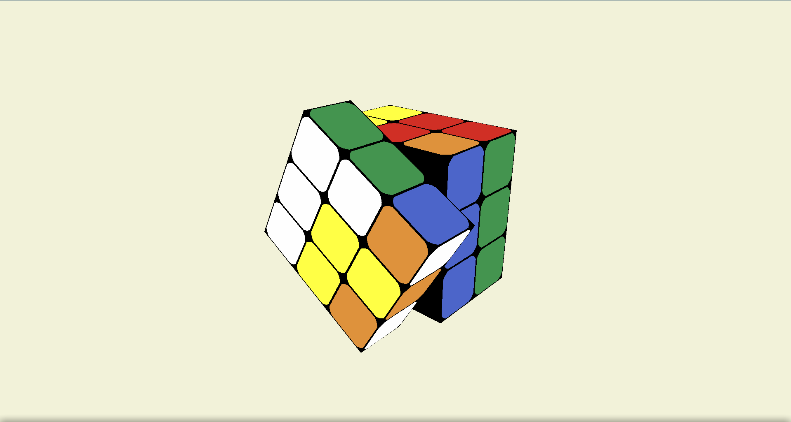
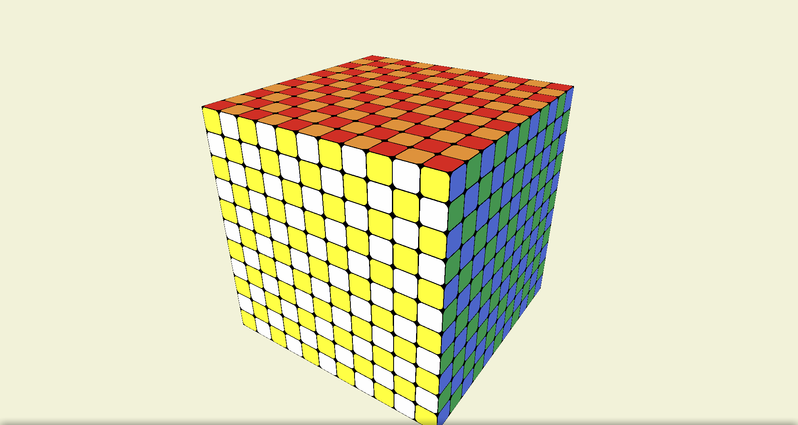

<h1>MonsterRubix</h1>

MonsterRubix is a program to display, scramble, and solve twisty puzzles. In theory, this program can solve
any scrambled cube 3x3x3 or larger given sufficient time and computing power.

The open-source 3D graphics library <a href="https://www.ogre3d.org/">Orge3D</a> was used to draw the cubes. In addition 
to being able to solve twisty puzzles, this program includes a "keyboard" mode that allows the user to virtually 
manipulate a twisty puzzle of arbitrary size.

 
 
<h1>Screenshots</h1>

<h4>Solving 5 cubes at once (3x3x3 through 7x7x7)</h4>

 
<h4>Solving a 3x3x3 twisty puzzle</h4>

 
<h4>Virtually manipulating an 11x11x11 twisty puzzle</h4>

 
 

<h1>Compiling (Linux)</h1>
<h4>1. Install the required dependencies</h4>
     <ol>
      <li><a href="https://www.ogre3d.org/download/sdk">Ogre3D 1.11&lt=</a></li>
      <li>C++ compilier (g++ recommended)</li>
      <li><a href="https://www.boost.org/doc/libs/1_72_0/more/getting_started/index.html">Boost libraries</a></li>
      <li><a href="https://cmake.org/download/">Cmake</a></li>
     </ol>
<h4>2. Clone the repo</h4>
 <code>
git clone https://github.com/dominicrabbott/monster-rubix.git
</code>
<h4>3. Build</h4>
  <code>
cd monster-rubix/build

        
cmake ..
        
        
make

   </code>
<h4>4. Run</h4>
   <code>
bin/MonsterRubix 3
</code>
 
 <h1>Usage</h1>
 
 <h3>Solving Twisty Puzzles</h3>
 
To scramble and solve twisty puzzles, provide a space-seperated list of integers that indicate the dimensions of the cube(s) to solve

 
e.g. <code>bin/MonsterRubix 3 4 5</code> will solve a 3x3x3, 4x4x4, and 5x5x5 twisty puzzle simultaneously

  
 
 <h3>Virtually Manipulating Twisty Puzzles</h3>
 
To virtually manipulate a twisty puzzle, run the program with the "keyboard" argument

 
<code>bin/MonsterRubix keyboard</code>

 
Rotations are made by typing in the following:

 <code>
&ltlayer number&gt  &ltface&gt [w] &ltEnter&gt
</code>
 
First, the layer is specified with a positive integer. The layers are counted starting at 1, which is the outermost layer, and are numbered 
 moving inwards.

 
Next, the face and rotation is specified with a letter. Each face has a corresponding letter:
 D (down, or bottom), T (top), L (left), R (right), F (front), and B (back). A capital letter indicates a 90 degree rotation, whereas
 a lowercase letter indicates a -90 degree rotation.

 
Then, 'w' is optionally provided. If this letter is provided, a 'wide' turn is performed, meaning all layers
 from the specified layer to the outermost layer are rotated. Otherwise, only the specified layer is rotated.

 
Lastly, hit the ENTER key to perform the rotation

 
The 'u' key can be pressed to undo the last rotation

 
  
 <h4>Examples</h4>
 
<code>2R &ltEnter&gt</code>Rotate the 2nd layer of the right face 90&deg</code>

 
<code>2r &ltEnter&gt</code>Rotate the 2nd layer of the right face -90&deg</code>

 
<code>3t &ltEnter&gt</code>Rotate the 3rd layer of the top face -90&deg</code>

 
<code>3T &ltEnter&gt</code>Rotate the 3rd layer of the top face 90&deg</code>

 
<code>4b &ltEnter&gt</code>Rotate the 4th layer of the back face -90&deg</code>

 
<code>3Fw &ltEnter&gt</code>Rotate layers 1-3 of the front face 90&deg</code>

 
 <h1>Technical Details</h1>
 
To solve 3x3x3 twisty puzzles, this program uses a modified form of 
 <a href="https://www.jaapsch.net/puzzles/thistle.htm">Thistlethwaite's 52-move algorithm</a>. The corners and edges of the puzzle
 are simultaneously solved in 4 stages. 4 lookup tables are generated and saved, one for each stage. All that is needed to
 solve the cube are 4 indexes into these lookup tables.

 
To solve any puzzle larger than 3x3x3, the <a href="https://www.speedsolving.com/wiki/index.php/Reduction_Method">Reduction Method</a> is used. 
 This method involves solving the edges and centers so the puzzle resembles a 3x3x3 puzzle. At this point, the cube can be solved as if it were a 3x3x3 puzzle.

A <a href="https://en.wikipedia.org/wiki/Best-first_search">best-first search</a> is used to solve the 
centers and edges of cubes larger than 3x3x3. The heuristic for this search is based on the number of center
pieces or edge pieces placed.

